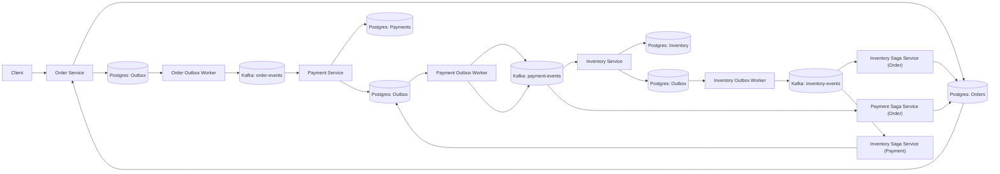

# Architecture

---

## Services

### Order Service (Python)

This is the entry point of the system and the starting point of the saga.

Responsibilities:
- Create orders
- Write order data to Postgres
- Write events to outbox table
- Start saga flow via Kafka
---

### Order Outbox Worker (Python)

Responsible for reliable event delivery from database to Kafka.

Responsibilities:
- Read pending events from Outbox table
- Publish events to Kafka (order-events)
- Mark events as processed
- Guarantee at-least-once delivery

---

### Payments Saga Worker (Python)

This service is a **saga state handler**, not a payment processor.

Responsibilities:
- Consume `payment-events` from Kafka
  - `payment_succeeded`
  - `payment_failed`
- Update Order state based on payment result
- Persist updated order status in Postgres
- Maintain saga progression state

This service acts as a **state transition handler for the Order aggregate** after payment completion.

---

### Inventory Saga Worker (Python)

This service is a **saga state transition handler**, not a business logic processor.

It reacts to the result of the inventory processing stage and updates the Order saga state accordingly.

---

**Responsibilities:**
- Consume inventory-related events from Kafka:
  - `inventory_reserved`
  - `inventory_failed`
- Update Order state in Postgres based on inventory outcome
- Persist final saga step state
- Ensure correct progression and completion of the saga workflow

---

This service does **not perform inventory reservation itself**.

Inventory reservation is executed earlier in the flow (Inventory Service / domain logic). This component only **tracks the result and projects it into the Order state machine**.

---

### Payments Service (Python)

This service handles payment processing as part of the saga flow.

Responsibilities:
- Consume `order-events` from Kafka
- Execute payment business logic
- Persist payment state in Postgres
- Write events to Payments Outbox table
- Publish `payment-events` to Kafka via Outbox Worker

This service follows the same **Outbox pattern** as the Order Service to guarantee reliable event delivery.

---

### Payments Outbox Worker (Python)

Responsible for reliable delivery of payment events to Kafka.

Responsibilities:
- Read pending events from Payments Outbox table
- Publish events to Kafka (`payment-events`)
- Apply retry + backoff strategy
- Send failed events to DLQ (`payment-events.dlq`)
- Guarantee at-least-once delivery

---

### Payment Inventory Saga Worker (Python)

This service is a **saga state handler inside the Payment domain**.

It reacts to inventory outcomes and determines whether a refund should be triggered.

Responsibilities:
- Consume `inventory-events` from Kafka:
  - `INVENTORY_FAILED`
- Locate related Payment record in Postgres
- Update payment status based on inventory result:
  - SUCCESS → no action (already completed)
  - INVENTORY_FAILED → initiate refund flow
- Create `payment_refunded` event if refund is required
- Write refund event to Payments Outbox table
- Ensure refund event is published reliably via Outbox Worker

This service is responsible for **compensating actions (refunds)** after inventory failure.

It does NOT modify Orders directly.

Order state changes are handled by Order Saga Workers.

### Inventory Service (Python)

This service handles inventory reservation after successful payment.

Responsibilities:
- Consume `payment-events` from Kafka
- Execute inventory reservation logic
- Validate and reserve stock (hardcoded now)
- Persist inventory state (hardcoded now)
- Write events to Inventory Outbox table
- Publish `inventory-events` via Outbox Worker

This service ensures inventory consistency after payment completion.

---

### Inventory Outbox Worker (Python)

Responsible for reliable delivery of inventory events to Kafka.

Responsibilities:
- Read pending events from Inventory Outbox table
- Publish events to Kafka (`inventory-events`)
- Apply retry + backoff strategy
- Send failed events to DLQ (`inventory-events.dlq`)
- Guarantee at-least-once delivery

---
### Inventory Service (Go - EXPERIMENT)

This is an experimental implementation of the Inventory service written in Go.

It is functionally equivalent to the Python Inventory Saga Worker but used to compare implementation approaches.

Responsibilities:
- check `Inventory Saga Worker (Python)`

This service is used for benchmarking and experimentation with Go in distributed systems.

---

### Notifications Service (Python - OBSERVER)

This service is not part of the business logic.

It is used for debugging and observability purposes.

Responsibilities:
- Subscribe to all Kafka topics:
  - `order-events`
  - `payment-events`
  - `inventory-events`
- Print all events to logs
- Help visualize the full saga flow in real time
- Assist in debugging distributed processing issues

---