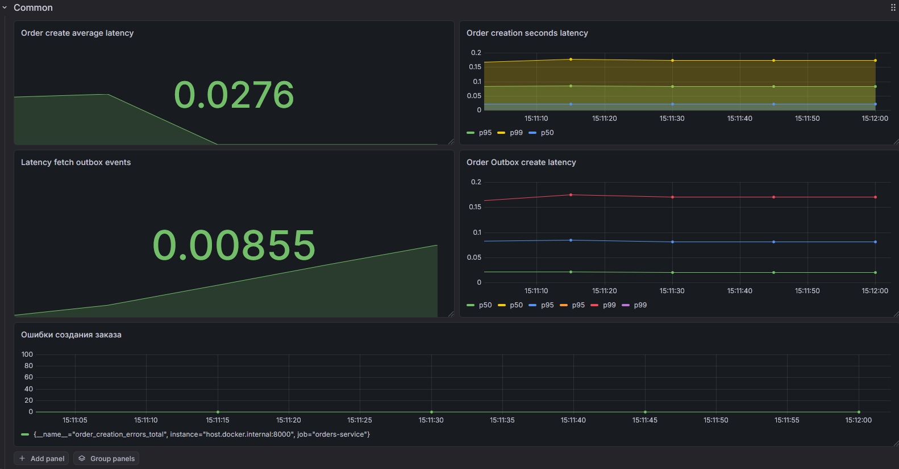
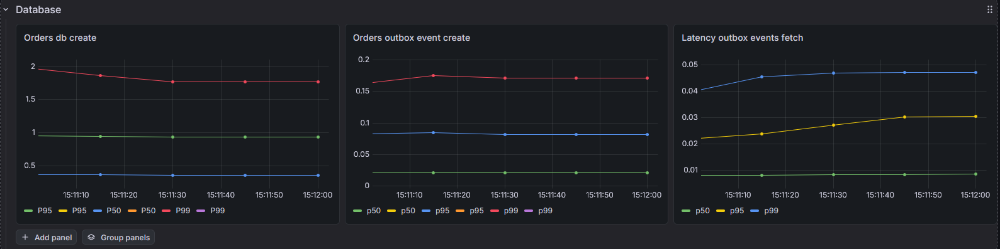
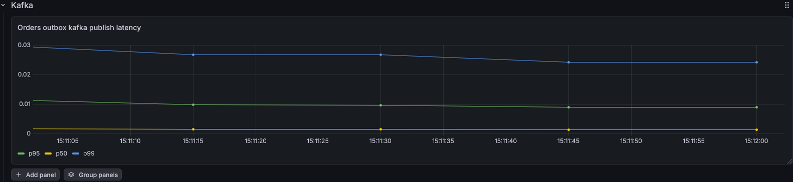

# Observability

## Grafana Dashboards

The system includes pre-configured Grafana dashboards for observability of all services.

Dashboards are stored as code:
```
infra/monitoring/grafana/dashboards/orders-service.json
```


This ensures reproducible observability setup across environments.

---

## Metrics Covered

The dashboards focus on:

- Order creation latency
- Kafka event processing lag
- Database query performance

---

## Visual Dashboards

Below are screenshots from Grafana:

### System Overview


### Database Performance


### Kafka Throughput & Lag


---

## Purpose

These dashboards allow:

- identifying bottlenecks in event flow
- tracking latency per service (now only in orders) step
- debugging distributed failures
- validating outbox + Kafka pipeline health

## Logs
All services in the system support **structured logging in production mode**.

When running in production mode:

- Logs are emitted in **structured JSON format**
- Logs are written to stdout (container-friendly)

---

### Logging Pipeline

Logs are collected and processed by external infrastructure:

- `Docker` / systemd logs
- `Loki` (log aggregation)
- `Grafana` (visualization)

---
### Grafana Integration

In production setup:

- Logs from all services are shipped to **Loki**
- Grafana is used for:
  - service-level debugging
  - saga flow tracing
  - error tracking
  - latency inspection

---

### Behavior by Mode

#### Development mode
- Pretty logs (human-readable)
- Local stdout only

#### Production mode
- Structured JSON logs
- Correlation IDs enabled
- Ready for Loki ingestion

---


